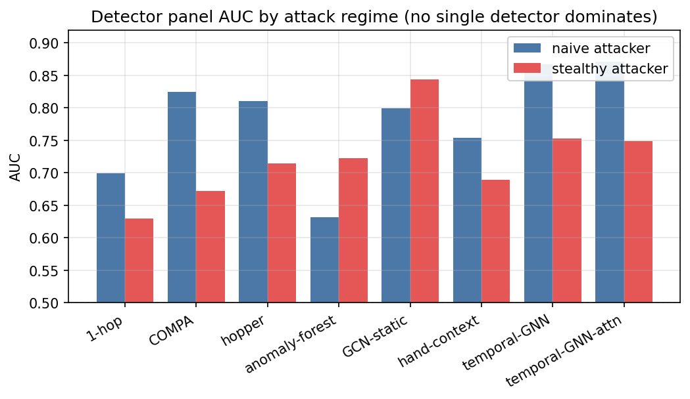
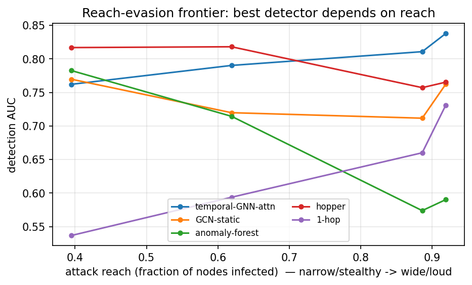
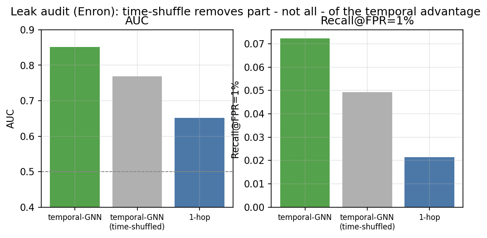

# CascadeBench

**CascadeBench** is a controlled, *leak-aware* adversarial testbed for evaluating graph-based
detectors of spear-phishing and lateral movement against *adaptive* attackers. It models lateral
phishing as a **propagation cascade** over a communication graph, generates ground-truth-labelled
attack and benign traffic, ships a panel of detectors (hand-crafted, gradient-boosted, and graph
neural networks) behind a single interface, and evaluates them under a methodology designed to
eliminate the confounders (rhythm/degree leakage) that inflate results on real corpora.

## Why leak-aware?

Real lateral-phishing corpora are proprietary and riddled with confounders: benign traffic often
differs from attack traffic in trivially separable ways (sender degree, identity, time-of-day
rhythm), so a detector can score well by exploiting a *leak* rather than by detecting the attack.
CascadeBench builds the anti-leak controls directly into evaluation — matched-design benign
traffic, victim-disjoint splits, a time-shuffle causal control, and operating-point metrics
(Recall at low FPR) — giving the steerability and ground truth that real corpora cannot.

## Results at a glance

All figures below are produced from the bundled CSVs in [`results/`](results/) (real
CascadeBench runs); regenerate them with `python docs/make_readme_figures.py`.

**No single detector dominates — the best method depends on the attack regime.** Against a
naive attacker the temporal GNNs lead; against a stealthy attacker the static GCN overtakes
them and the 1-hop baseline collapses.



**Detection is a frontier, not a point.** As the attacker trades reach for evasion the ranking
reorders — structure-aware detectors degrade differently from tabular baselines.



**Leak audit.** The time-shuffle control removes *part but not all* of the temporal GNN's
advantage on the Enron graph — evidence of genuine cascade dynamics rather than a pure
timing artefact. Note that Recall@FPR=1% stays low across the board (the operationally hard
regime that AUC hides).



| Detector | AUC (naive) | AUC (stealthy) |
|---|---|---|
| 1-hop | 0.70 | 0.63 |
| COMPA | 0.83 | 0.67 |
| hopper | 0.81 | 0.71 |
| anomaly-forest | 0.63 | 0.72 |
| GCN-static | 0.80 | **0.84** |
| hand-context | 0.75 | 0.69 |
| temporal-GNN | 0.87 | 0.75 |
| temporal-GNN-attention | **0.87** | 0.75 |

_(synthetic organization, ≥20 seeds, 95% CI half-widths ≤ 0.02; best per regime in bold)_

## Do I need an LLM? (No, for the benchmark)

**The benchmark does not use an LLM.** Graphs, cascade attacks, detectors, and the leak-aware
evaluation are fully procedural, and the synthetic population is shipped pre-generated in
[`data/twins/`](data/twins/) (150 personas). Everything in the "Quick start", the CLI, and the
experiments runs offline with no API calls.

An LLM is used only to **regenerate** the C1–C8 personas with
[`data/twin_generator.py`](data/twin_generator.py) — an optional step you never need to
reproduce the results. To enable it:

```bash
cp config.example.py config.py          # config.py is git-ignored
export OPENAI_BASE_URL="https://api.openai.com/v1"   # or your internal endpoint
export OPENAI_API_KEY="sk-..."
export PPD_TWIN_MODEL="gpt-4o-mini"      # any OpenAI-compatible chat model
pip install -e .[llm]
```

`config.py` must expose `PPD_TWIN_MODEL` and `make_client_for(model)` (an OpenAI-compatible
client) — see [`config.example.py`](config.example.py). If the endpoint uses a private
certificate authority, run `import truststore; truststore.inject_into_ssl()` first.

## Paper

The accompanying paper (LaTeX sources) lives in [`paper/`](paper/) — entry point
[`paper/main.tex`](paper/main.tex), references in `paper/refs.bib`. Build with
`pdflatex main && bibtex main && pdflatex main && pdflatex main`, or open the repository in
Overleaf (set `paper/main.tex` as the main document).

## Install

Requires Python >= 3.10. Dependencies: `numpy`, `scikit-learn`, `lightgbm`, `torch`. CPU-only is
fully supported; a CUDA build of `torch` is optional and only speeds up the GNN detectors.

From the repository root:

```bash
pip install -e .          # runtime install
pip install -e .[dev]     # plus pytest for running the test suite
```

## Quick start

### Python API (3 lines)

```python
import cascadebench as cb

g   = cb.Graph.synthetic(800)                                 # or cb.load("email-Eu-core") / "enron"
sc  = cb.build_scenario(g, cb.CascadeStrategy(fanout=8, spread=2), seed=0)
res = cb.evaluate(sc, cb.get_panel(), seed=0)                 # AUC + Recall@{0.1%,0.5%,1%,5%} per detector
```

### Command line

The package installs a `cascadebench` entry point (equivalently `python -m cascadebench`):

```bash
cascadebench demo         --graph synthetic:500 --fanout 8 --spread 1   # one scenario, print panel metrics
cascadebench pareto       --graph synthetic:600 --seeds 3               # evasion <-> reach Pareto front (fan-out sweep)
cascadebench adaptive     --graph synthetic:600 --fanout 5              # adaptive attacker at fixed reach (spread sweep)
cascadebench panel        --graph email-Eu-core                        # detector panel under attacker strategies
cascadebench leak-audit   --graph enron                                # rhythm-leak audit (benign off-hours sweep)
cascadebench arms-race    --graph synthetic:400 --rounds 3 --budget 6  # automated red/blue co-search to equilibrium
```

Additional subcommands: `predictivity` (rank-transfer probe across topologies), `fabrication`
(edge-fabricating OSINT attack vs. panel), `mechanism` (GCN-inflation ablation), and
`robustness-grid` (finding stability vs. design choices).

## Components

| Module | Role |
|--------|------|
| `graph.py`   | Communication graph: `Graph.synthetic(N)` (procedural org graph), `Graph.from_edgelist` (SNAP-style `src dst [timestamp]`), `Graph.enron` (real headers) |
| `attack.py`  | Threat model: `CascadeStrategy` separates **reach** (fan-out K) from **evasion** (spread / mimicry / fabrication); `build_scenario` composes attack cascades with leak-aware benign traffic |
| `detect.py`  | Detector panel behind one `Detector.fit_score` interface: `OneHop`, `COMPA`, `Hopper`, `AnomalyForest`, `StaticGNN`, `HandContext`, `TemporalGNN`, `TemporalGNNAttn` |
| `evaluate.py`| **Leak-aware** evaluation core: victim-disjoint split, Recall@low-FPR, time-shuffle control, off-hours rhythm audit |
| `experiments.py` / `search.py` | Reproducible experiments (`pareto`, `adaptive`, `panel`, `leak_audit`) and automated red/blue co-search (`attack_search`, `defense_search`, `arms_race`) |

## Leak-aware evaluation

The evaluation core (`evaluate.py`, `attack.py`) enforces four controls that distinguish
CascadeBench from static benchmarks:

- **Matched-design benign** — benign traffic is drawn from the same endpoint/degree distribution as
  the attack (`benign_traffic(..., matched=True)`), removing the identity/degree confounder.
- **Victim-disjoint split** — `victim_split` partitions events so that no victim appears in both
  train and test, preventing per-victim memorization from leaking across the split.
- **Time-shuffle control** — `shuffle_time` reassigns event time buckets at random; a genuine signal
  must collapse under it, providing a causal check that the detector uses temporal structure rather
  than an artifact.
- **Recall at low FPR** — `recall_at_fpr` / the `recall@{0.001,0.005,0.01,0.05}` metrics report
  operating-point performance instead of AUC alone, plus an off-hours rhythm audit (`off_hours`
  benign) that checks the score does not ride on a "benign is always in-rhythm" assumption.

## Extending

- **New detector** — subclass `cb.Detector` and implement
  `fit_score(scenario, train_mask, test_mask, seed) -> scores`, then include it in your panel.
- **New graph** — `cb.Graph.from_edgelist(path)` for any `src dst [timestamp]` edge list, or
  `cb.Graph.synthetic(N)` for a procedural organization graph of arbitrary size.
- **New attack** — set the reach/evasion knobs on `cb.CascadeStrategy`
  (`fanout`, `spread`, `mimicry`, `fabrication`), or write a function that emits labelled events and
  wraps them in a `cb.Scenario`.

## Reproducing the examples

The reproducible study drivers ship inside the package (`cascadebench/experiments.py` and
`cascadebench/search.py`), exposed through the CLI:

```bash
python -m cascadebench panel      --graph enron        # detector panel
python -m cascadebench leak-audit --graph enron        # time-shuffle leak audit
python -m cascadebench pareto     --graph synthetic:600  # reach--evasion frontier
python -m cascadebench adaptive   --graph synthetic:600  # adaptive attacker
```

Each is deterministic and seeded and writes result CSVs into `results/`. The CSVs used by the
figures in this README and the paper (`cb_panel.csv`, `cb_headline_ci.csv`,
`cb_robustness_curves.csv`, `cb_transfer.csv`, `exp_cascade_enron.csv`) are tracked so the
figures regenerate offline via `python docs/make_readme_figures.py`.

## Testing

```bash
pip install -e .[dev]
pytest -q
```

Tests live in `cascadebench/tests/` and exercise the main features (graph construction, scenario
building, panel evaluation, determinism, and the time-shuffle leak control) on small CPU-only
graphs.

## Dependencies and environment

- Python >= 3.10
- `numpy`, `scikit-learn`, `lightgbm`, `torch` (runtime); `pytest` (dev extra)
- CPU-only is sufficient; a CUDA `torch` build optionally accelerates the GNN detectors.

## License

Released under the MIT License. See [`LICENSE`](LICENSE). Every source file carries an SPDX
`MIT` license header.

## Citation

If you use CascadeBench in academic work, please cite it (Zenodo DOI: **TODO**):

```bibtex
@software{cascadebench2026,
  author  = {Warpechowski, Kamil and Ksiezopolski, Bogdan},
  title   = {CascadeBench: A Leak-Aware Adversarial Testbed for Graph-Based
             Spear-Phishing and Lateral-Movement Detection},
  year    = {2026},
  version = {0.1.0},
  url     = {https://github.com/kwarpechowski/cascadebench},
  note    = {DOI: TODO}
}
```

## Contact

Kamil Warpechowski, Bogdan Ksiezopolski — Kozminski University.
Support: kamil.warpechowski@kozminski.edu.pl
